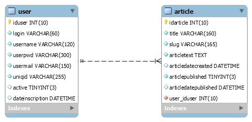

# Exe-classe2-MVC-CRUD-procedural

## Création du premier CRUD

Vous allez devoir créer votre premier `CRUD` complet sur une table :

- **C**reate
- **R**eade
- **U**pdate
- **D**elete

Le tout dans une structure de type `MVC` 'maison', pour bien comprendre les principes, tout en restant en procédural pour le moment.

## Rappel du système MVC

### Objectifs

- Utiliser un dossier `public` qui contiendra un contrôleur frontal.
- Avoir une partie publique affichant les articles publiés par date de publication descendante.
- Avoir un système de connexion pour accèder à l'administration
- Pouvoir y afficher, modifier, supprimer ou créer des articles.

### Pour commencer

- Faites un `fork` de ce repository sur votre compte github.
- Clonez-le sur votre ordinateur.
- Liez le projet à `upstream` (ce repository)
- Créez une branche de travail
- Créez un dossier avec votre prénom dans `stagiaires`
- Copiez-y (dans `stagiaires/<votre_prénom>`) tous mes fichiers et dossiers **SANS** les modifier/déplacer (à part `stagiaires`, `.git`, etc...) !
- Importez la base de donnée `data/crud_mvc_procedural_structure_v1_datas.sql` dans `MySQL` ou `MariaDB` en adaptant le `port` dans **votre** `config-dev.php`

### La base de donnée

Elle se nomme `crud_mvc_procedural` et elle contient 2 tables :

- `user`
- `article`

#### `user`

- `iduser`
- `login`
- `username`
- `userpwd`
- `usermail`
- `uniqid`
- `active`
- `dateinscription`

#### `article`

- `idarticle`
- `title`
- `slug`
- `articletext`
- `articledatecreated`
- `articlepublished`
- `articledatepublished`
- `user_iduser`

### Schéma

Il y a une relation **one to many** de la table `user` vers la table `article`.

### Attente

Pour créer ce crud, inutile de s'attarder sur le design, imitez l'exercice fait en classe :

https://github.com/WebDevCF2m2025/first-crud-c2-exemple

